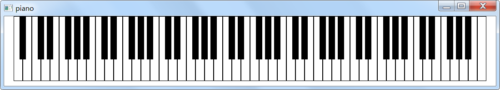

# piano
一个 win32 下的 模拟钢琴 小程序

midi piano

## SreenShot


## KeyBoard (键盘)
```
Large Group:      Z X C V B N M
Small Group:      A S D F G H J
1st Small Groupl: Q W E R T Y U ( Numpad 1 2 3 4 5 6 7)
2nd Small Group:  1 2 3 4 5 6 7
3rd Small Group:  K L ; I O P 8

大字组:      Z X C V B N M
小字组:      A S D F G H J
小字一组:    Q W E R T Y U ( 数字键 1 2 3 4 5 6 7 )
小字二组:    1 2 3 4 5 6 7
小字三组:    K L ; I O P 8
```
## Eggs (彩蛋)
F1, F2

## Compile
pascal compiler

free pascal compiler
```
fpc piano.pas
```